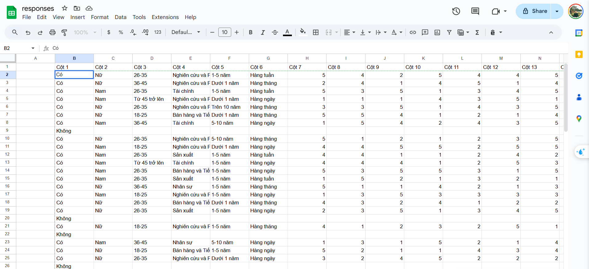

1. Đầu tiên là xác định form của mình như thế nào ?
   - Có bao nhiều phần, các phần sẽ được điền nhưu thế nào (điền text hay lựa chọn duy nhất hay lựa chọn nhiều,...)
   - Logic của form : Ví dụ tại 1 câu hỏi nào đó, lựa chọn 1 sẽ rẽ một hướng, lựa chọn 2 sẽ rẽ một hướng khác,... hoặc lựa chọn 1 sẽ cho người dùng tiếp tục điền form, lựa chọn 2 sẽ khiến form kết thúc,....
   - Đây sẽ là form mình thực hiện chạy thử nghiệm script: https://forms.gle/ENEEPP9qLHG1JjJs5
2. Lấy entryID (ID của câu hỏi) bằng script chạy trên Google Apps Script: 
	- **ClaudeAI**: "Sử dụng Google Apps Script để lấy questionID"

```javascript
function getQuestionIds() {
  var form = FormApp.getActiveForm();
  var items = form.getItems();
  
  for (var i = 0; i < items.length; i++) {
    Logger.log(items[i].getId() + ': ' + items[i].getTitle());
  }
}
```

3. Viết Script: 
	- Sử dụng AI Claude: Prompt : "Sử dụng Google Apps Script để điền số lượng lớn Google Form", tinh chỉnh yêu cầu để Claude sửa code theo đúng dạng form của mình

	- Đưa cho nó list questionID mình đã thu được và yêu cầu nó tự thay vào code cho phù hợp

	- Cơ bản thì cấu trúc script sẽ kiểu như sau
		- Lấy ID Form: Do đã tạo form trước rồi nên ta sẽ điền được ID form ở đây
		- Lấy ID Sheet: Do chưa tạo sheet, ta cứ để trống ID sheet đã rồi chèn vào sau.
		- Trả lời các câu hỏi (entryID):
			- **CHÚ Ý 1**, tùy dạng câu hỏi-câu trả lời mà code sẽ khác 
			- **CHÚ Ý 2**: Định dạng cho sheet phải chuẩn để bên code lấy dữ liệu chuẩn 
				- VD: Trong Sheet: hàng 0 là header, hàng 1 là phiếu trả lời cho câu hỏi đầu tiên, trong hàng 1, cột số 1 là câu trả lời cho câu hỏi số 1, bên code cũng phải lấy đúng dữ liệu từ ô đó để trả lời cho câu hỏi đó. Ta có thể dễ bị nhầm lẫn khi ở bên Sheet định dạng hàng 1 cột 0 trả lời cho câu hỏi số 1 mà bên code ta lại lấy hàng 1 cột 1 để trả lời cho câu hỏi số 1 => lấy không đúng dữ liệu cần lấy => Script khi chạy sẽ báo lỗi.
		- Gửi phiếu trả lời (submit)
	
**Các đoạn script/code dưới đây là áp dụng cho form mà mình đã để bên trên.**
```javascript
function fillForms() {
  var form = FormApp.openById('1ANKECwHy9597TJjUQhHfH0oDKV8qk6V_DOUUuwKguEE');
  var sheet = SpreadsheetApp.openById('1VGArdc6wra_K4KbOMnfJ--r86egoYD20RDDdXl3QhN0').getActiveSheet();
  var data = sheet.getDataRange().getValues();

  // Tạo một Map chứa tất cả các item ID
  var itemIds = {
    section1: ['1086688632'],
    section2: ['1937116451', '1241712557', '259537383', '1869304156', '1372263537'],
    section3: ['1572887955', '2013096424', '919647803', '1746194685', '1973021200', '1105142489'],
    section4: ['850752258', '1095387875', '1286346176', '614569977', '493756437', '779837881'],
    section5: ['299343643', '1893615111', '337846597', '1424481674', '1222665968', '447480852'],
    section6: ['1909905029', '1444346953', '606740247', '1478338764', '1787842949', '1774583153']
  };

  for (var i = 1; i < data.length; i++) {
    var formResponse = form.createResponse();

    // Section 1
    formResponse.withItemResponse(
      form.getItemById(itemIds.section1[0]).asMultipleChoiceItem().createResponse(data[i][1])
    );

    // Kiểm tra nếu Section 1 trả lời là "Không", gửi biểu mẫu ngay
    if (data[i][1] === "Không") {
      formResponse.submit();
      continue; // Chuyển sang dòng dữ liệu tiếp theo
    }

    // Section 2 - Thông tin chung
    for (var j = 0; j < itemIds.section2.length; j++) {
      formResponse.withItemResponse(
        form.getItemById(itemIds.section2[j]).asMultipleChoiceItem().createResponse(data[i][j + 2])
      );
    }

    // Section 3 - AI - Đào tạo và Phát triển
    for (var j = 0; j < itemIds.section3.length; j++) {
      formResponse.withItemResponse(
        form.getItemById(itemIds.section3[j]).asScaleItem().createResponse(data[i][j + 7])
      );
    }

    // Section 4 - AI - Thúc đẩy gắn kết công việc
    for (var j = 0; j < itemIds.section4.length; j++) {
      formResponse.withItemResponse(
        form.getItemById(itemIds.section4[j]).asScaleItem().createResponse(data[i][j + 13])
      );
    }

    // Section 5 - Hiệu suất làm việc
    for (var j = 0; j < itemIds.section5.length; j++) {
      formResponse.withItemResponse(
        form.getItemById(itemIds.section5[j]).asScaleItem().createResponse(data[i][j + 19])
      );
    }

    // Section 6 - Gắn kết trong công việc
    for (var j = 0; j < itemIds.section6.length; j++) {
      formResponse.withItemResponse(
        form.getItemById(itemIds.section6[j]).asScaleItem().createResponse(data[i][j + 25])
      );
    }

    // Gửi đầy đủ biểu mẫu nếu Section 1 là "Có"
    formResponse.submit();
  }
}
```
4. Viết mã Python tự động gen ra data cho sheet phiếu trả lời
	- Sheet được tạo ra sẽ có cấu trúc: 
		Hàng đầu tiên là Header ghi các câu hỏi, từ các hàng sau, mỗi hàng được coi như 1 phiếu trả lời

		Mỗi cột là câu trả lời cho 1 câu hỏi => mỗi ô sẽ là câu trả lời của một câu hỏi của một phiếu trả lời nào đó
	- Với trường hợp form là dạng chọn các đáp án duy nhất:
		- Thiết lập danh sách các lựa chọn cho câu hỏi
			VD: Câu hỏi 1 (Cột 1) có 4 lựa chọn là "A", "B", "C", "D"

			Ta có thể làm chi tiết hơn ở bước này với các yêu cầu chi tiết về tỉ lệ số lượng các câu trả lời kiểu:
				Với câu hỏi 1, ta cơ cấu để số câu trả lời A là 70%, B là 2%,...

		- Thiết lập số phiếu trả lời muốn có
	- Chạy xong ta sẽ được **file CSV**
>generate_data.py
```python
import csv
import random

def generate_responses(output_file, num_responses):
    # Các lựa chọn với trọng số thực tế hơn
    column_1_choices = ["Có", "Không"]
    column_2_choices = ["Nam", "Nữ"]
    column_3_choices = ["18-25", "26-35", "36-45", "Từ 45 trở lên"]
    column_4_choices = ["Sản xuất", "Bán hàng và Tiếp thị", "Nhân sự", "Nghiên cứu và Phát triển", "Tài chính"]
    column_5_choices = ["Dưới 1 năm", "1-5 năm", "5-10 năm", "Trên 10 năm"]
    column_6_choices = ["Hiếm khi", "Hàng ngày", "Hàng tuần", "Hàng tháng"]

    # Trọng số (weights) cho các lựa chọn
    column_1_weights = [0.8, 0.2]  # "Không" chiếm khoảng 20%
    column_2_weights = [0.6, 0.4]  # Nam chiếm 60%
    column_3_weights = [0.3, 0.4, 0.2, 0.1]  # Phân phối độ tuổi
    column_4_weights = [0.2, 0.3, 0.1, 0.25, 0.15]  # Ngành nghề
    column_5_weights = [0.3, 0.4, 0.2, 0.1]  # Thâm niên làm việc
    column_6_weights = [0.1, 0.4, 0.3, 0.2]  # Tần suất sử dụng

    # Mở tệp để ghi
    with open(output_file, mode='w', newline='', encoding='utf-8') as file:
        writer = csv.writer(file)
        # Tiêu đề cột
        header = ["Cột 1", "Cột 2", "Cột 3", "Cột 4", "Cột 5", "Cột 6"] + [f"Cột {i}" for i in range(7, 33)]
        writer.writerow(header)

        # Sinh dữ liệu ngẫu nhiên
        for _ in range(num_responses):
            column_1 = random.choices(column_1_choices, weights=column_1_weights, k=1)[0]
            
            # Nếu cột 1 là "Không", các cột còn lại sẽ để trống
            if column_1 == "Không":
                row = [column_1] + [""] * (len(header) - 1)
            else:
                # Sinh dữ liệu ngẫu nhiên cho các cột còn lại
                column_2 = random.choices(column_2_choices, weights=column_2_weights, k=1)[0]
                column_3 = random.choices(column_3_choices, weights=column_3_weights, k=1)[0]
                column_4 = random.choices(column_4_choices, weights=column_4_weights, k=1)[0]
                column_5 = random.choices(column_5_choices, weights=column_5_weights, k=1)[0]
                column_6 = random.choices(column_6_choices, weights=column_6_weights, k=1)[0]

                # Các giá trị từ cột 7 đến 32 (ngẫu nhiên trong khoảng 1 đến 5)
                other_columns = [random.randint(1, 5) for _ in range(7, 33)]

                # Tạo dòng dữ liệu
                row = [column_1, column_2, column_3, column_4, column_5, column_6] + other_columns

            writer.writerow(row)

# Tạo dữ liệu
output_file = "responses_realistic.csv"
num_responses = 225  # Số lượng phiếu trả lời
generate_responses(output_file, num_responses)
print(f"Đã tạo tệp {output_file} với {num_responses} phiếu trả lời.")
``` 
Sau khi có đoạn code này thì lưu lại, mở terminal tại nơi chứa file rồi chạy:
> python generate_data.py

5. Đưa file CSV lên sheet
	- Có thể tạo sheet mới hoặc chèn vào một sheet sẵn có(tùy ý) nhưng nhớ cái sheet chứa data này, ID của nó phải được đưa vào script
		- Đảm bảo như **CHÚ Ý 2**, định dạng của sheet phải chuẩn. *Như Sheet này phải tạo thêm 1 cột bên trái vì đoạn script AI tạo ra (mình lười sửa :>) bắt đầu lấy câu trả lời cho câu hỏi đầu tiên ở ô 1 cột 1 (data[i][1]), không phải lấy từ ô 1 cột 0 nên ta tạo thêm 1 cột để script lấy đúng ô dữ liệu mà ta mong muốn*
	- Sau khi tạo sheet xong ta sẽ có ID, chèn lại ID này vào script
6. Chạy Script
   - Từ form, nhấn 3 chấm chọn **<>Script editor**
   - Ta được chuyển sang Google Apps Script, đưa script đã viết vào và chạy, với lần chạy đầu tiên sẽ bị yêu cầu cấp quyền, nó sẽ báo nguy hiểm hay gì đó nhưng ta cứ tiếp tục cho nó chạy: Advance -> ... unsafe.... ->...
   - Chờ mã chạy xong 
   - **CHÚ Ý**: Script chỉ chạy được trong 6p, nên có thể trong 6p đó nó không thể xử lý được hết số lượng phiếu trả lời mà ta muốn, nên lựa vào tình hình, nó kết thúc ở đâu, đã gửi được bao nhiêu phiếu thì ta xóa đi bằng đấy phiếu ở bên sheet và tiếp tục chạy lại script để nó gửi tiếp các phiếu mới,cứ lặp lại như vậy.
